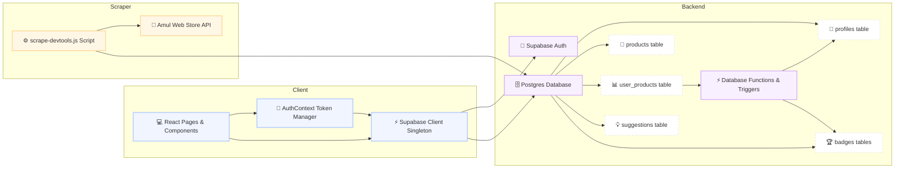

# Architecture Documentation - AmulPaglu

This document details the high-level architecture, data flows, and component breakdown of the **AmulPaglu** application.

---

## 1. System Architecture Diagram

The system consists of three main boundaries: the **React Client** (Vite SPA), the **Supabase Backend** (Database, Storage, & Auth), and the **Scraper Client** (used for syncing catalog data from Amul).




---

## 2. Component Directory Structure

The frontend application follows a standard React SPA design pattern inside Vite:

```
d:/amulpaglu/src/
├── components/          # Reusable UI elements & layouts
│   ├── auth/            # ProtectedRoute guards
│   ├── ui/              # Low-level visual tokens (cards, inputs, badges)
│   └── Layout.tsx       # Sidebar navigation and general screen framing
├── contexts/            # React Context Providers
│   ├── AuthContext.tsx  # Dedicated session managers & profile loader loops
│   └── ToastContext.tsx # Application-wide toasts
├── lib/
│   └── supabase.ts      # Supabase client singleton setup (no-op locking config)
├── pages/               # Routing targets
│   ├── Admin/           # Admin catalogs & moderation
│   ├── Dashboard.tsx    # User stats, dynamic progress loops & badges
│   ├── Explore.tsx      # Interactive product explore grid (tried/want-to-try toggle)
│   ├── MyList.tsx       # User's curated tried and bookmarked products
│   ├── Leaderboard.tsx  # Gamified community points ranking
│   └── Suggest.tsx      # Suggestion boards for missing products
└── types/               # TypeScript interfaces & database schemas
    └── database.ts      # Generated database table structure definitions
```

---

## 3. Data Schema & Core Tables

The PostgreSQL database leverages Foreign Key constraints to connect products to user profiles:

1. **`profiles`**: Stores gamification points (`total_points`), custom usernames, and admin status flags.
2. **`products`**: The catalog of Amul items. Fields include points values, rarity categories (`Common`, `Epic`, `Legendary`), image URLs, and approval status.
3. **`user_products`**: Tracks individual relationship connections between a user and a product (e.g. status of `'tried'` or `'want_to_try'`, with notes and timestamp).
4. **`badges` & `user_badges`**: Gamification achievements. Automatically awarded via database triggers/functions when specific category or tried thresholds are reached.
5. **`suggestions`**: Crowdsourced items submitted by users. Reviewed by administrators before being pushed into the main products catalog.
6. **`scrape_logs`**: Tracks scraper runs, logs success/error detail dumps, and tracks run summaries.

---

## 4. Key Security & Resilience Implementations

* **Row Level Security (RLS)**: Every table has Postgres RLS enabled. Users can only write their own `user_products` or `suggestions` rows, while tables like `products` are publicly readable for authenticated users.
* **Token De-duplication**: To prevent browser tab sleep from deadlocking network queues, `AuthContext` uses a shared Promise Ref cache to redirect concurrent JWT token refresh requests into a single task.
* **Lock Bypassing**: Client-side locking is disabled in the Supabase initialization options. This avoids browser Web Locks collisions when tabs are un-suspended.
