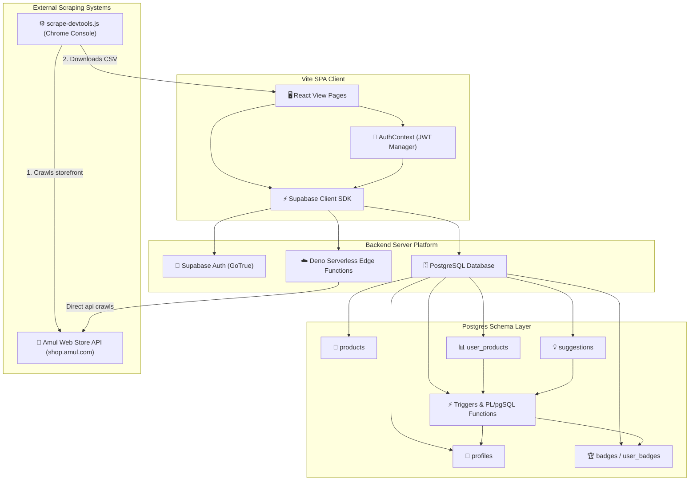
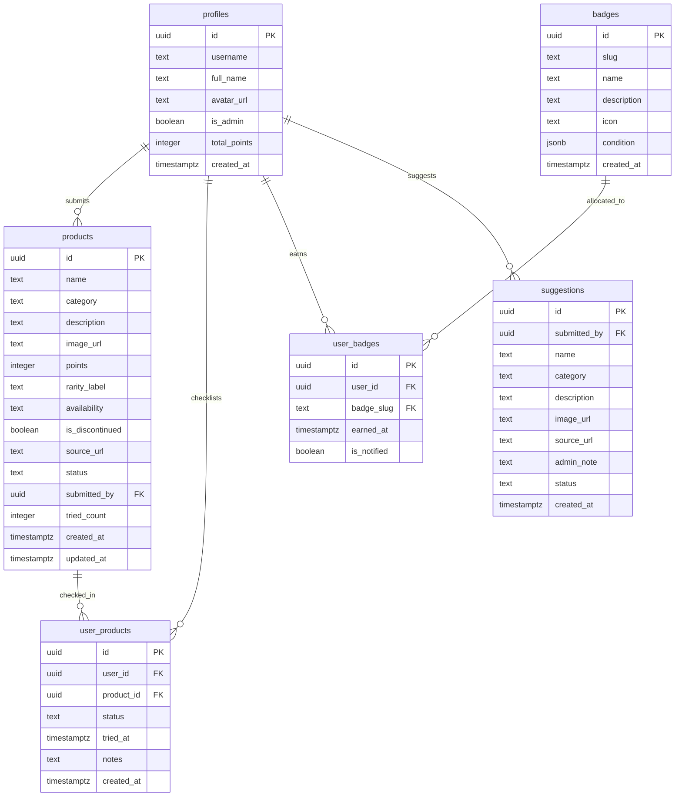

# AmulPaglu 🥛👑

<p align="center">
  
</p>

<p align="center">
  <a href="https://amulpaglu.com"><strong>🚀 Live Demo: amulpaglu.com</strong></a>
</p>

AmulPaglu is a gamified checklist and exploration catalog for Amul dairy products in India. Users can browse Amul's catalog, mark products they have tried or want to try, earn points based on item rarity, unlock achievement badges via automated database triggers, and rank on a public leaderboard.

This repository serves as a complete blueprint for an open-source, serverless web application using React 19, Vite, Tailwind CSS v4, and Supabase (Postgres, GoTrue Auth, and Deno Edge Functions).

---

## Onboarding Guide

Follow these steps to set up and run the application locally on your machine.

### 1. Database Setup (Supabase)
To run this application, you must link it to a Supabase project:
1. Create a project in your [Supabase Dashboard](https://supabase.com/).
2. Open the **SQL Editor** in your Supabase project dashboard.
3. Run the database setup scripts in order:
   * **Tables Schema**: Paste and run the query script inside [create-tables.sql](./supabase/queries/create-tables.sql) to instantiate table structures, relational keys, and indexes.
   * **Triggers & Functions**: Paste and run [create-triggers.sql](./supabase/queries/create-triggers.sql) to set up automatic profile creation for new users, tried points accrual triggers, and column security checks.
   * **RLS Policies**: Paste and run [configure-rls.sql](./supabase/queries/configure-rls.sql) to configure Postgres Row-Level Security policies.
   * **Badges Feature**: Paste and run [configure-badges.sql](./supabase/queries/configure-badges.sql) to setup achievements conditions and insert default seed badges.

### 2. Environment Configurations
1. Copy `.env.example` to a new file named `.env` in the root folder.
2. Fill in the parameters with credentials from your Supabase Project Settings:
   * `VITE_SUPABASE_URL`: Your Supabase API host URL.
   * `VITE_SUPABASE_ANON_KEY`: Your project anonymous web client key.

### 3. Local Installation
Run the package installation:
```bash
npm install
```

### 4. Seed Product Catalog Data
Amul products data must be seeded into the database catalog:
1. Open Google Chrome and go to [shop.amul.com](https://shop.amul.com).
2. Open the Chrome DevTools console (press `F12` or right-click -> **Inspect** -> **Console** tab).
3. Copy the full code content of the [scrape-devtools.js](./scripts/scrape-devtools.js) script, paste it directly in the browser console, and press `Enter`.
4. Wait for the browser crawl to finish. It will automatically download a CSV file named `amul-products-YYYY-MM-DD.csv` containing product catalog details.
5. In your local app, sign up for a new user account, then run the SQL statement in your database SQL Editor to grant admin permissions to this user (replace `'your-username-here'` with your username):
   ```sql
   UPDATE public.profiles SET is_admin = true WHERE username = 'your-username-here';
   ```
6. Start the local server (`npm run dev`), go to the **Admin > Scraper** tab (`http://localhost:5173/admin/scraper`), and click **Upload CSV**.
7. Upload the downloaded `amul-products-YYYY-MM-DD.csv` file. This uploads and seeds the database catalog.

### 5. Running & Mobile Testing
* **Start local server**:
  ```bash
  npm run dev
  ```
* **Testing on Mobile**:
  Vite is configured to listen to all network cards (`server.host: true`). Open the local network IP printed in the terminal (e.g. `http://192.168.1.100:5173/`) in your phone's browser.
* **Testing HTTPS APIs**:
  Certain client APIs (like Web Share or Clipboard API) require HTTPS security contexts. You can create a secure local tunnel for testing using `localtunnel`:
  ```bash
  npx localtunnel --port 5173
  ```
  Open the generated `https://...` link in your mobile web app context.

---

## Table of Contents
* [Onboarding Guide](#onboarding-guide)
1. [High-Level Architecture](#1-high-level-architecture)
2. [Codebase Analysis](#2-codebase-analysis)
3. [Database & ERD Reference](#3-database--erd-reference)
4. [Hidden Knowledge & Engineering Decisions](#4-hidden-knowledge--engineering-decisions)
5. [Testing & Verification](#5-testing--verification)

---

## 1. High-Level Architecture

AmulPaglu is architected as a **Serverless SPA (Single Page Application)** interacting with a backend-as-a-service (BaaS) platform.



---

## 2. Codebase Analysis

The codebase is organized into modules separated by visual concerns, business workflows, state contexts, and helper utilities.

### Module Breakdown
*   **`src/App.tsx`**: Entry point for routing. Contains code-splitting configs (`React.lazy`) and suspends pages inside a `<Suspense>` loader.
*   **`src/pages/`**: Individual page modules.
    *   `Landing.tsx`: Public portal. Fetches aggregated analytics and public stats in a single network roundtrip via `get_landing_page_data` RPC.
    *   `Dashboard.tsx`: Displays points, rank stat cards, progress rings, and quick links.
    *   `Explore.tsx`: Search catalog. Decoupled using query string selectors (`?search=...`) to support deep linking.
    *   `MyList.tsx`: Grid organizer separating checklist items into "Want to try" and "Tried" segments, with inline notes editing.
    *   `Leaderboard.tsx`: Connects to user profiles to render a podium of top ranks.
    *   `Profile.tsx`: User stats dashboard displaying points, tier badge alignments, and earned/locked badges.
*   **`src/components/`**:
    *   `auth/`: Route authorization guards (`ProtectedRoute`, `AdminRoute`).
    *   `badges/`: Renders dynamic badge overlays (`BadgeUnlockPopup`, `BadgesSection`).
    *   `products/`: Visual card layouts (`ProductCard`, `ProductImage`).
    *   `ui/`: Design tokens and alerts (`Toast.tsx`, `Skeleton.tsx`).
*   **`src/contexts/`**: Shared state.
    *   `AuthContext.tsx`: Tracks authentication session tokens. Implements visibility listeners to automatically refresh tokens when window focus returns.
    *   `ThemeContext.tsx`: Appends the `.dark` selector to `<html>` for theme styles.
*   **`src/lib/`**:
    *   `supabase.ts`: Supabase client initialization. Bypasses client-side web locks to prevent mobile tab freezing.
    *   `share.ts`: Custom Web Share API integrations. Handles mobile native sharing and clipboard fallbacks.
*   **`supabase/functions/`**: Deno Edge serverless functions.
    *   `scrape-products/`: Scrapes `shop.amul.com` using regional pincode lists. It verifies JWT credentials via GoTrue auth headers and checks admin permissions in the database before inserting items.

---

## 3. Database & ERD Reference

The PostgreSQL database enforces security constraints and access control using Row-Level Security (RLS) policies and automated triggers:



### Core SQL Scripts (`supabase/queries/`)
*   `create-tables.sql`: Instantiates database schemas, primary/foreign keys, check constraints, and performance indexes.
*   `create-triggers.sql`: Defines:
    1.  `handle_new_user()`: Automatically inserts a row into `profiles` when a user signs up.
    2.  `award_points_on_tried()`: Updates user points when a checklist item status is toggled.
    3.  `protect_profile_columns()`: Prevents non-admin client calls from modifying points or admin flags.
*   `configure-rls.sql`: Sets security policies. Users can select profiles and products, but can only insert, update, or delete their own `user_products` and `suggestions` rows.
*   `configure-badges.sql`: Instantiates the badges definitions and seeds conditions (e.g. `tried_count`, `category_complete`).

---

## 4. Hidden Knowledge & Engineering Decisions

### 1. Web Locks mobile deadlock bypass
In `src/lib/supabase.ts`, browser Web Locks are bypassed by default:
```typescript
lock: (async (_name, _timeout, fn) => await fn()) as any
```
*   **Why**: Mobile browsers (like iOS Safari) freeze tab processes when active tabs go into background sleep. Standard Supabase client token storage uses Web Locks. When mobile tabs wake up, locked resources can cause the app to hang. This bypass prevents mobile deadlocks.

### 2. Relational Type Assertions Bypassing
Vite's generated schema typings do not include join relations. The code uses type assertions to safely access related profile usernames:
```typescript
const products = data as unknown as ProductWithSubmitter[]
```
When querying joined tables, cast data arrays using the `ProductWithSubmitter` type defined in `src/types/index.ts` to maintain type safety.

### 3. Dynamic Badge Checking (PL/pgSQL Functions)
Badge evaluations run dynamically inside the database rather than on the client.
*   Triggers automatically check and award badges during checklist updates.
*   The client uses a database RPC function (`get_and_clear_new_badges`) to retrieve new awards, mark them as notified, and trigger the confetti notification modal.

---

## 5. Testing & Verification

*   **Unit Tests**: The app uses Vitest for unit testing. Run the tests with:
    ```bash
    npm run test
    ```
*   **Production Build**: Run a compilation build to verify that lazy loading code splitting compiles correctly:
    ```bash
    npm run build
    ```

